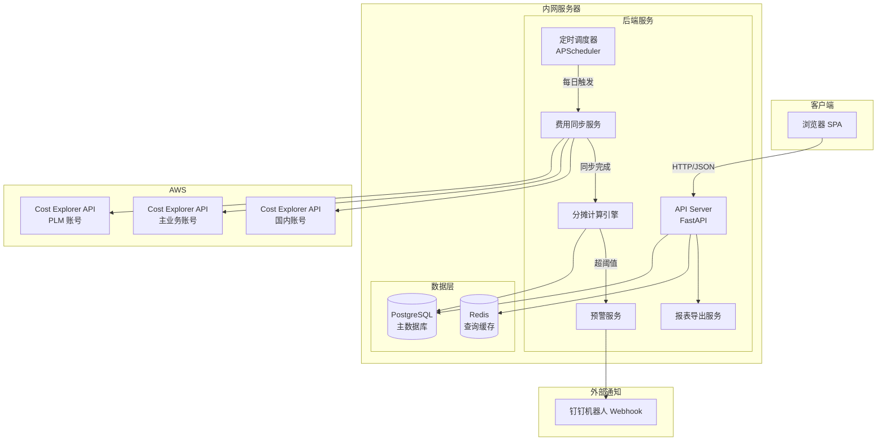
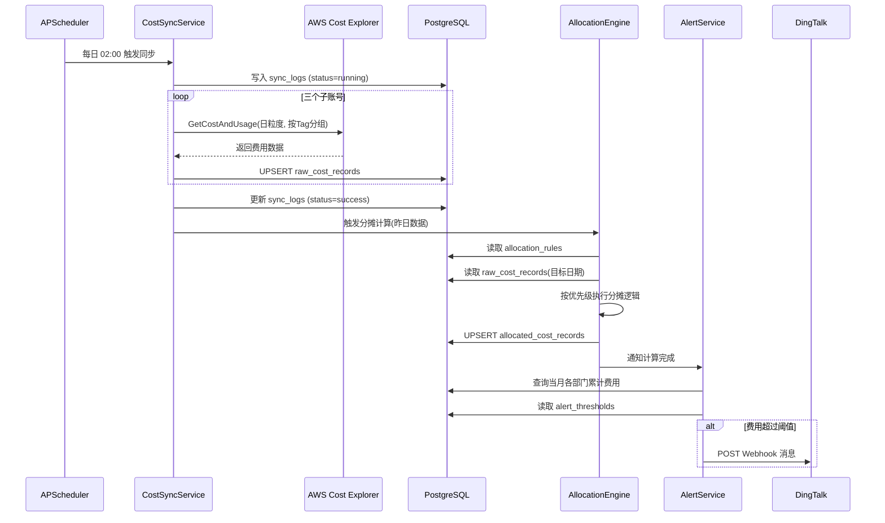
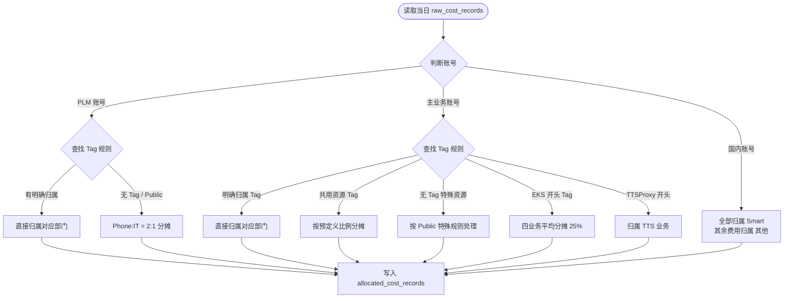

# 技术设计文档：Nothing AWS 费用统计平台

## 概述

Nothing AWS 费用统计平台是一个内网 Web 系统，通过 AWS Cost Explorer API 每日同步三个子账号的费用数据，按照预定义的 Tag 归属规则和分摊规则将费用分配到各业务部门，并提供多维度可视化展示、费用预警和报表导出功能。

系统采用前后端分离架构，后端提供 RESTful API，前端为单页应用（SPA）。数据同步通过定时任务驱动，分摊计算在同步完成后自动执行。

---

## 架构设计

### 高层架构图



### 技术选型

| 层次 | 技术选型 | 理由 |
|------|---------|------|
| 后端框架 | Python + FastAPI | 异步支持好，AWS SDK（boto3）生态成熟，开发效率高 |
| 定时任务 | APScheduler | 轻量，与 FastAPI 集成简单，无需额外中间件 |
| 数据库 | PostgreSQL | 支持复杂聚合查询，JSON 字段支持灵活存储规则，成熟稳定 |
| 缓存 | Redis | 缓存高频查询结果，降低数据库压力 |
| 前端框架 | React + TypeScript | 组件化开发，生态丰富 |
| 图表库 | ECharts | 支持折线图/柱状图/饼图，中文文档完善 |
| 报表导出 | openpyxl（Excel）、csv 模块（CSV）、WeasyPrint（PDF） | Python 原生或成熟库 |
| AWS SDK | boto3 | AWS 官方 Python SDK |
| 容器化 | Docker + Docker Compose | 简化内网部署 |

---

## 组件与接口

### 后端核心组件

**CostSyncService（费用同步服务）**
- 调用三个账号的 Cost Explorer API，拉取日粒度原始费用数据
- 将原始数据写入 `raw_cost_records` 表
- 同步完成后触发 AllocationEngine

**AllocationEngine（分摊计算引擎）**
- 读取 `allocation_rules` 表中的当前规则
- 按优先级顺序（明确归属 → 共用分摊 → Public 规则）处理每条原始记录
- 将计算结果写入 `allocated_cost_records` 表
- 支持对指定日期范围重新计算（历史重算）

**AlertService（预警服务）**
- 在每次分摊计算完成后，汇总各业务部门当月累计费用
- 与 `alert_thresholds` 表中的阈值对比
- 超阈值时调用钉钉 Webhook 发送通知

**ExportService（报表导出服务）**
- 接收查询参数，生成对应格式文件（xlsx / csv / pdf）
- 文件生成后以流式响应返回客户端

---

## 数据模型

### 核心表结构

```sql
-- 原始费用记录（从 AWS 同步的原始数据）
CREATE TABLE raw_cost_records (
    id              BIGSERIAL PRIMARY KEY,
    account_id      VARCHAR(20) NOT NULL,        -- AWS 账号 ID
    account_name    VARCHAR(50) NOT NULL,         -- PLM / 主业务 / 国内
    date            DATE NOT NULL,               -- 费用日期
    service         VARCHAR(100) NOT NULL,        -- AWS 服务名称
    tag_key         VARCHAR(100),                -- Tag 键
    tag_value       VARCHAR(200),                -- Tag 值
    amount_usd      NUMERIC(12, 4) NOT NULL,     -- 费用金额（美元）
    currency        VARCHAR(10) DEFAULT 'USD',
    synced_at       TIMESTAMPTZ NOT NULL DEFAULT NOW(),
    UNIQUE (account_id, date, service, tag_key, tag_value)
);

-- 分摊后费用记录
CREATE TABLE allocated_cost_records (
    id              BIGSERIAL PRIMARY KEY,
    date            DATE NOT NULL,
    account_name    VARCHAR(50) NOT NULL,
    tag_value       VARCHAR(200),                -- 原始 Tag 值
    business_module VARCHAR(100),               -- 业务模块名称
    department      VARCHAR(50) NOT NULL,        -- 业务部门
    amount_usd      NUMERIC(12, 4) NOT NULL,     -- 分摊后金额
    rule_id         BIGINT REFERENCES allocation_rules(id),
    calculated_at   TIMESTAMPTZ NOT NULL DEFAULT NOW()
);
CREATE INDEX idx_allocated_date ON allocated_cost_records(date);
CREATE INDEX idx_allocated_dept ON allocated_cost_records(department);

-- 分摊规则表
CREATE TABLE allocation_rules (
    id              BIGSERIAL PRIMARY KEY,
    account_name    VARCHAR(50) NOT NULL,         -- 适用账号
    tag_value       VARCHAR(200),                -- Tag 值（NULL 表示 Public 规则）
    rule_type       VARCHAR(20) NOT NULL,         -- direct / shared / public
    business_module VARCHAR(100),
    department      VARCHAR(50),                 -- 直接归属时使用
    ratios          JSONB,                       -- 分摊比例，如 {"Phone":0.7,"Smart":0.2,"销售":0.1}
    special_config  JSONB,                       -- 特殊规则配置（如 MongoDB 阈值）
    is_active       BOOLEAN DEFAULT TRUE,
    created_at      TIMESTAMPTZ DEFAULT NOW(),
    updated_at      TIMESTAMPTZ DEFAULT NOW()
);

-- 规则变更历史
CREATE TABLE allocation_rule_history (
    id              BIGSERIAL PRIMARY KEY,
    rule_id         BIGINT NOT NULL,
    changed_at      TIMESTAMPTZ DEFAULT NOW(),
    old_value       JSONB,
    new_value       JSONB,
    changed_by      VARCHAR(100) DEFAULT 'admin'
);

-- 费用预警阈值
CREATE TABLE alert_thresholds (
    id              BIGSERIAL PRIMARY KEY,
    department      VARCHAR(50) NOT NULL UNIQUE,
    monthly_threshold_usd NUMERIC(12, 2) NOT NULL,
    is_active       BOOLEAN DEFAULT TRUE,
    updated_at      TIMESTAMPTZ DEFAULT NOW()
);

-- 同步任务日志
CREATE TABLE sync_logs (
    id              BIGSERIAL PRIMARY KEY,
    started_at      TIMESTAMPTZ NOT NULL,
    finished_at     TIMESTAMPTZ,
    status          VARCHAR(20) NOT NULL,         -- running / success / failed
    accounts_synced VARCHAR(200),
    records_count   INT,
    error_message   TEXT
);
```

---

## API 设计

所有接口前缀：`/api/v1`

### 费用查询接口

```
GET /costs/daily
  Query: start_date, end_date, department?, account_name?, tag_value?
  Response: { data: [{ date, department, amount_usd }], total }

GET /costs/monthly
  Query: year, month?, department?, account_name?
  Response: { data: [{ year_month, department, amount_usd }], total }

GET /costs/summary
  Query: start_date, end_date
  Response: { by_department: [...], by_account: [...], by_tag: [...] }
```

### 分摊规则管理接口

```
GET  /rules                    -- 获取所有分摊规则
PUT  /rules/:id                -- 更新规则
POST /rules/:id/recalculate    -- 触发历史重算
  Body: { start_date, end_date }
```

### 预警阈值接口

```
GET  /alerts/thresholds        -- 获取所有阈值
PUT  /alerts/thresholds/:dept  -- 更新某部门阈值
```

### 报表导出接口

```
GET /export
  Query: format(xlsx|csv|pdf), start_date, end_date, department?, account_name?
  Response: 文件流（Content-Disposition: attachment）
```

### 同步管理接口

```
GET  /sync/logs                -- 获取同步日志列表
POST /sync/trigger             -- 手动触发同步（管理员用）
```

---

## 前端页面结构

```
App
├── Layout（顶部导航 + 侧边栏）
│   ├── 费用总览页 /dashboard
│   │   ├── 时间范围选择器（日/月粒度切换）
│   │   ├── 维度筛选器（部门/账号/Tag）
│   │   ├── 图表区域（折线图/柱状图/饼图切换）
│   │   └── 费用汇总数据表格
│   ├── 费用明细页 /costs
│   │   ├── 高级筛选面板
│   │   ├── 数据表格（分页）
│   │   └── 导出按钮（xlsx/csv/pdf）
│   ├── 分摊规则管理页 /rules
│   │   ├── 规则列表（按账号分组）
│   │   └── 规则编辑表单（比例输入，实时校验总和=100%）
│   └── 预警设置页 /alerts
│       └── 各部门阈值设置表单
```

---

## 数据同步流程



### 同步失败处理

- 同步任务失败时，`sync_logs.status` 置为 `failed`，记录 `error_message`
- 下次定时任务触发时，检查前一天是否有成功的同步记录，若无则补充同步
- 支持通过 `POST /sync/trigger` 手动触发补同步

---

## 费用分摊计算逻辑

### 处理流程



### 分摊守恒性约束

对于每一条原始费用记录，分摊后各部门金额之和必须等于原始金额（精度误差 ≤ $0.01）：

```
sum(allocated_cost_records.amount_usd WHERE raw_record_id = X) 
  == raw_cost_records.amount_usd WHERE id = X
```

### MongoDB Atlas 特殊规则

```python
def allocate_mongodb(total_amount):
    base = Decimal("2500.00")
    if total_amount <= base:
        # Nothing-x 和 SharedWidget 各 50%
        return {"Nothing-x": total_amount / 2, "SharedWidget": total_amount / 2}
    else:
        # 基础部分平分，超出部分全归 Nothing-x
        return {
            "Nothing-x": base / 2 + (total_amount - base),
            "SharedWidget": base / 2
        }
```

---

## 费用预警流程

1. 每次分摊计算完成后，汇总各业务部门当月（自然月）累计 `allocated_cost_records`
2. 与 `alert_thresholds` 对比
3. 超阈值时，构造钉钉消息并调用 Webhook

### 钉钉消息格式

```json
{
  "msgtype": "markdown",
  "markdown": {
    "title": "AWS 费用预警",
    "text": "### ⚠️ AWS 费用预警\n\n**业务部门**：{department}\n\n**当月累计费用**：${current_amount}\n\n**预警阈值**：${threshold}\n\n**超出金额**：${current_amount - threshold}\n\n**统计时间**：{date}"
  }
}
```

---

## 正确性属性

*属性（Property）是在系统所有合法执行中都应成立的特征或行为——本质上是对系统应做什么的形式化陈述。属性是人类可读规范与机器可验证正确性保证之间的桥梁。*

### 属性 1：数据同步覆盖所有账号

*对于任意*一次同步任务执行，同步完成后数据库中应存在来自三个子账号（PLM、主业务、国内）的费用记录。

**验证需求：1.2**

### 属性 2：同步后自动触发分摊计算

*对于任意*一批成功同步的原始费用数据，同步完成后应能在 `allocated_cost_records` 中查询到对应日期的分摊结果。

**验证需求：1.6**

### 属性 3：分摊费用守恒

*对于任意*一条原始费用记录，经过分摊计算后，所有分摊结果的金额之和应等于原始金额（允许 $0.01 的精度误差）。

**验证需求：4.2、4.3**

### 属性 4：月度汇总等于日粒度之和

*对于任意*月份和业务部门，月度汇总费用应等于该月所有日粒度分摊费用之和。

**验证需求：2.2**

### 属性 5：查询结果在时间范围内

*对于任意*合法的查询时间范围 [start_date, end_date]，返回的所有费用记录的日期应在该范围内，不包含范围外的数据。

**验证需求：2.3**

### 属性 6：查询结果包含必要维度字段

*对于任意*费用查询结果，每条记录应包含日期、业务部门、子账号、业务模块（Tag）和金额字段。

**验证需求：2.4、2.5、2.6**

### 属性 7：规则修改后查询返回新规则（Round-trip）

*对于任意*分摊规则修改操作，保存后立即查询该规则，应返回修改后的值。

**验证需求：5.2**

### 属性 8：分摊比例之和为 100%

*对于任意*共用资源分摊规则，其 `ratios` 字段中所有部门的比例之和应等于 1.0（100%）。

**验证需求：5.4**

### 属性 9：超阈值时发送包含完整信息的通知

*对于任意*业务部门，当其当月累计费用超过预设阈值时，发送的钉钉通知应包含部门名称、当前费用金额和阈值三个字段。

**验证需求：6.2、6.3**

### 属性 10：导出数据与查询结果一致

*对于任意*查询条件，导出的 Excel/CSV 文件中的数据行数和金额应与相同条件下 API 查询返回的结果一致。

**验证需求：7.1、7.2、7.4**

### 属性 11：历史重算结果与新规则一致

*对于任意*历史日期范围，使用新规则重新计算后，`allocated_cost_records` 中对应日期的记录应与直接使用新规则计算的结果一致。

**验证需求：4.4**

---

## 错误处理

| 场景 | 处理策略 |
|------|---------|
| AWS API 调用失败 | 记录错误日志，标记同步任务失败，下次任务自动补同步 |
| 分摊规则缺失（Tag 无匹配规则） | 记录警告日志，将该费用归入"未分类"部门，不中断计算 |
| 分摊比例配置错误（总和≠100%） | 规则保存时前端和后端双重校验，拒绝保存并返回错误提示 |
| 钉钉 Webhook 调用失败 | 记录错误日志，不影响主流程，下次计算时重试 |
| 数据库连接失败 | 返回 503 错误，记录日志 |
| 导出文件生成超时 | 返回 504 错误，建议缩小查询范围 |

---

## 测试策略

### 单元测试

针对核心业务逻辑编写单元测试，重点覆盖：
- 分摊计算引擎各分支逻辑（明确归属、共用分摊、Public 规则、MongoDB 特殊规则）
- 月度汇总聚合计算
- 预警阈值判断逻辑
- 钉钉消息内容构造

### 属性测试（Property-Based Testing）

使用 **Hypothesis**（Python 属性测试库）实现属性测试，每个属性测试最少运行 100 次。

每个属性测试需在注释中标注对应的设计属性，格式：
`# Feature: nothing-aws-cost, Property {N}: {属性描述}`

| 属性 | 测试方式 | 生成策略 |
|------|---------|---------|
| 属性 3：分摊费用守恒 | 生成随机费用金额和规则，验证分摊后总和等于原始金额 | `st.decimals(min_value=0, max_value=100000)` |
| 属性 4：月度汇总等于日粒度之和 | 生成随机月份数据，验证聚合结果 | `st.dates()` + `st.decimals()` |
| 属性 5：查询结果在时间范围内 | 生成随机时间范围，验证返回数据的日期边界 | `st.dates()` |
| 属性 7：规则修改 Round-trip | 生成随机规则配置，保存后查询验证 | `st.fixed_dictionaries()` |
| 属性 8：分摊比例之和为 100% | 生成随机比例配置，验证保存校验逻辑 | `st.floats()` |
| 属性 9：预警通知内容完整 | 生成随机部门费用和阈值，验证通知消息字段 | `st.decimals()` |
| 属性 10：导出数据与查询一致 | 生成随机查询条件，对比 API 结果与导出文件内容 | `st.dates()` + `st.sampled_from()` |
| 属性 11：历史重算结果一致 | 生成随机历史数据和新规则，验证重算结果 | `st.lists()` + `st.fixed_dictionaries()` |

### 集成测试

- 使用 `pytest` + `testcontainers` 启动真实 PostgreSQL 实例
- Mock AWS Cost Explorer API（使用 `moto` 库）
- Mock 钉钉 Webhook（使用 `responses` 库）
- 覆盖完整的同步 → 分摊 → 预警流程
